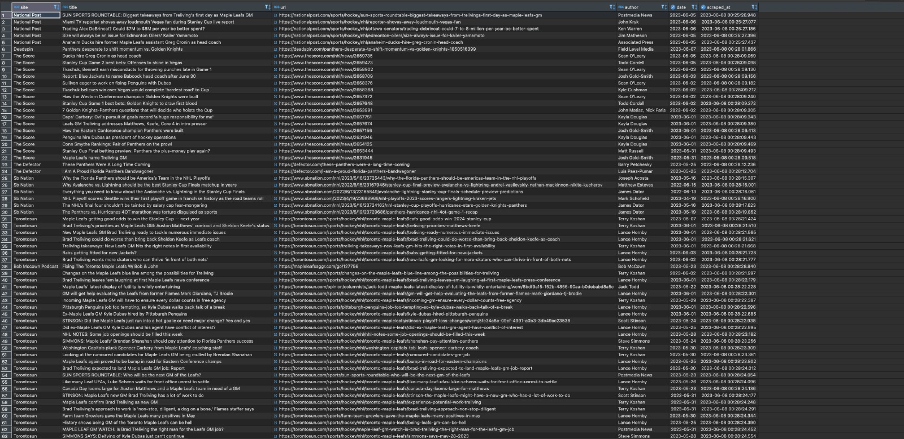

# Web Scraping Project for Article Extraction - Maple Leafs maple-leafs Team

This repository showcases a successful web scraping project that involved the development of a tool to extract articles related to the Maple Leafs maple-leafs team from various websites. As a skilled web scraper, I was hired to build this tool to parse multiple websites for specific keywords and retrieve relevant articles. The project was completed within a short-term timeframe, and close collaboration with the client's team ensured that the tool met the required specifications.

## Project Details

- **Objective:** The goal of this project was to develop a script or set of scripts to extract articles about the Maple Leafs maple-leafs team from different websites.
- **Preferred Languages:** The client expressed a preference for using JavaScript, PHP, or Python for the implementation, although other languages were also considered.
- **Server Execution:** The client required the tool to be runnable on their server using a cron job or similar scheduling mechanism for automated periodic execution.
- **DigitalOcean Integration:** Familiarity with DigitalOcean and assistance in deploying the script on their platform were considered beneficial.

## Showcase

This project successfully scraped articles from twenty six different websites, provided by the client. The web crawlers were specifically designed to search for articles related to the Maple Leafs hockey team. The extracted information includes the article URL, title, author, and date published. All relevant data was stored in a database, enabling easy access and further analysis. The Bots are running in Digital Ocean on every 30 minutes searching for new articles.

The Robots are retrieving the data from:

- Global News
- Bob McCown Podcast
- NHL News
- The Score
- Fansided
- CBC
- Sporting News
- NBC Sports
- The Globe and Mail
- CBS Sports
- Forbes
- Toronto Sun
- Associated Press
- CTV News
- The Defector
- NHL Maple Leafs
- The Star
- NHLPA
- Bleacher Report
- The Leafs Nation
- The Athletic
- ESPN
- Deadspin
- National Post
- Editor in Leaf
- SB Nation

## License

This project is licensed under the [MIT License](LICENSE), allowing for the free usage, modification, and distribution of the codebase.

## Contact

If you have any questions or inquiries regarding this project, please feel free to reach out via the contact information provided in the repository.

Thank you for your interest in this web scraping project focused on extracting articles about the Maple Leafs hockey team.
